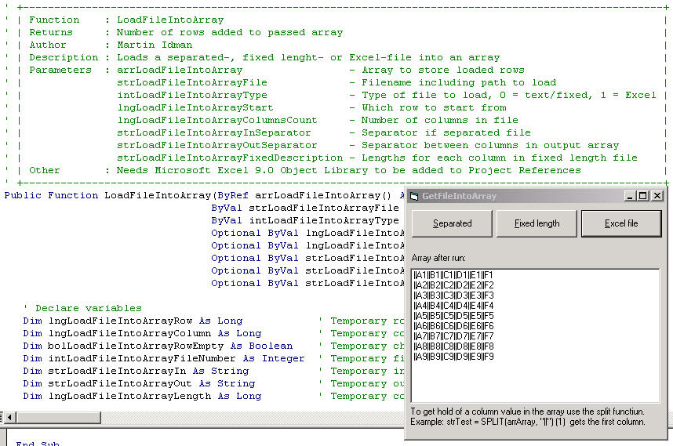



## LoadFileIntoArray

### Description

Function that loads delimeted, fixed or Excel-files into an array.
 
### More Info
 
Described in code

Number of rows addded to array

             |
---                |---
**Submitted On**   |2003-09-15 05:44:02
**By**             |[Martin Idman](https://github.com/Planet-Source-Code/PSCIndex/blob/master/ByAuthor/martin-idman.md)
**Level**          |Beginner
**User Rating**    |5.0 (10 globes from 2 users)
**Compatibility**  |VB 6\.0
**Category**       |[Files/ File Controls/ Input/ Output](https://github.com/Planet-Source-Code/PSCIndex/blob/master/ByCategory/files-file-controls-input-output__1-3.md)
**World**          |[Visual Basic](https://github.com/Planet-Source-Code/PSCIndex/blob/master/ByWorld/visual-basic.md)
**Archive File**   |[LoadFileIn1645569152003\.zip](https://github.com/Planet-Source-Code/martin-idman-loadfileintoarray__1-48507/archive/master.zip)

